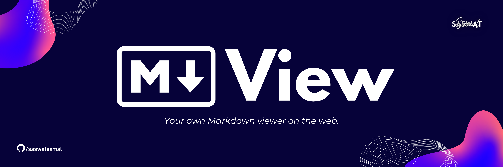

<i>Your own Markdown Viewer on the Web</i>

<a href="https://markview.netlify.app/"/>

<h2 align="center">About</h2>

<i><bold>markView</bold> is a online Markdown Previewer where you can see the preview of your markdown side by side.</i>
  
 
 It is built using HTML, CSS and Javascript only. The rendering from markdown is done using <code>showdown.js</code> library.

<h2 align="center">Preview</h2>

## Features 🚀
1. Real Time Rendering  🚀
2. Mobile Responsive too 📲

## Required Improvements ✅➕
1. Table (in markdown) is not rendering. ❌
2. Enhancing the color theme. ✨

## Built with

## Want to collaborate and enhance this project?
- Fork the repository. 🍴
- Create a issue in the current repository about your issue. 💭
- Add your enhancement. ✔️
- Create a Pull Request with proper comments and description. ☑️
- Wait for your PR to get merged after reviewing. 🕰️

 Built by Saswat Samal 

